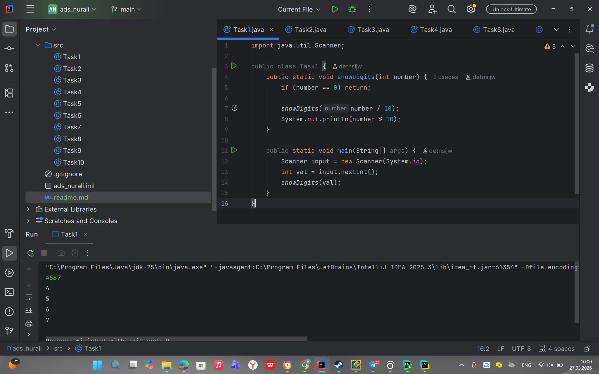
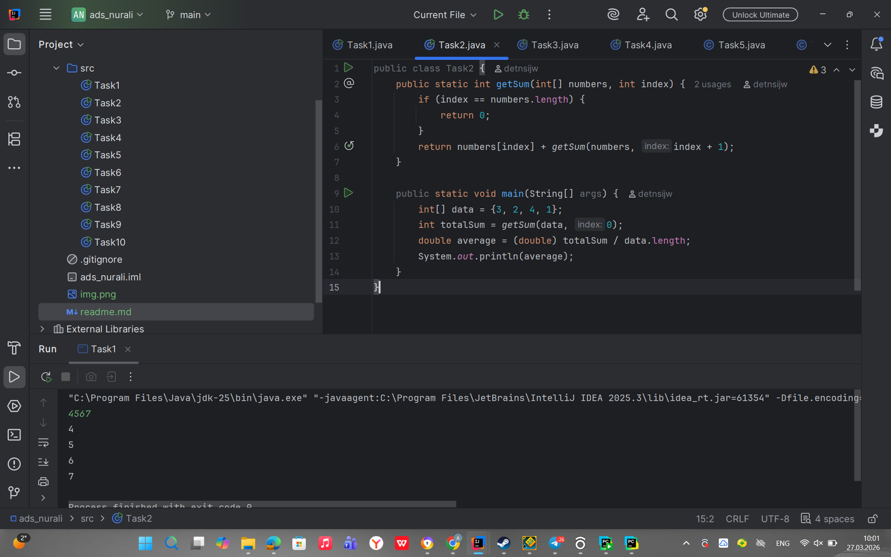
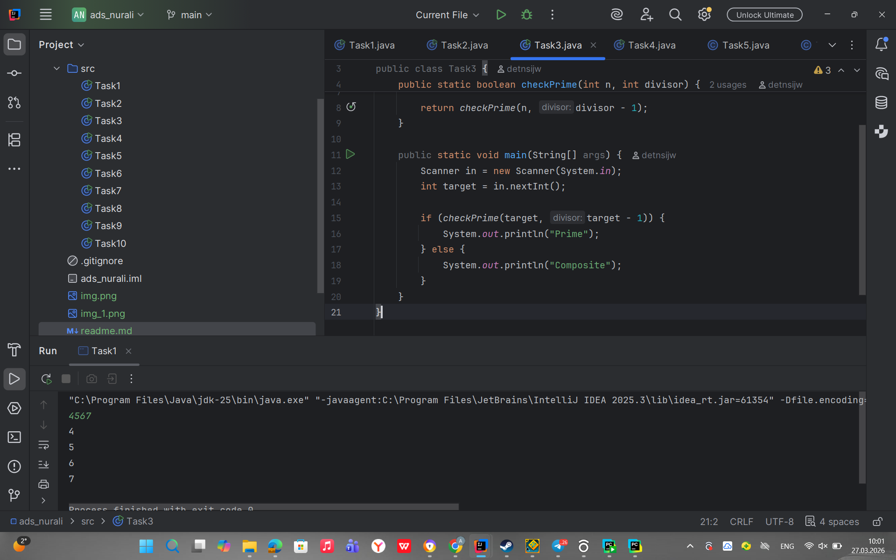
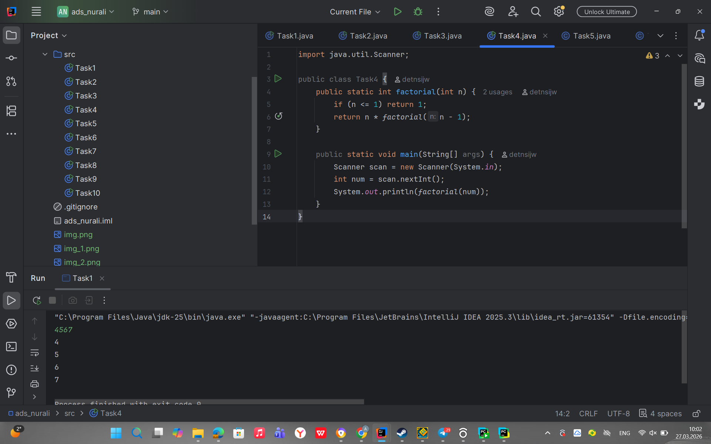
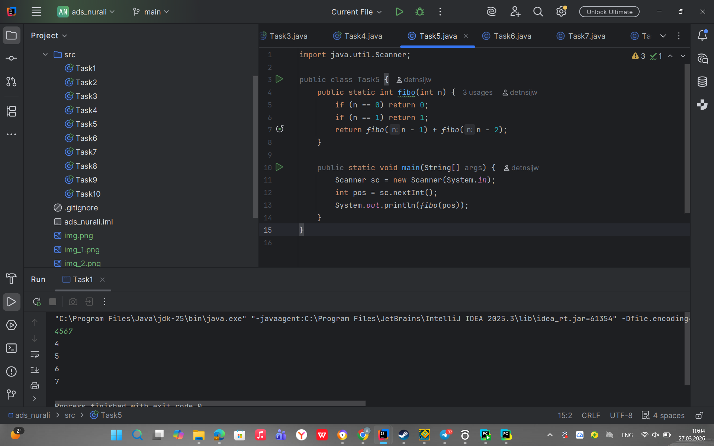
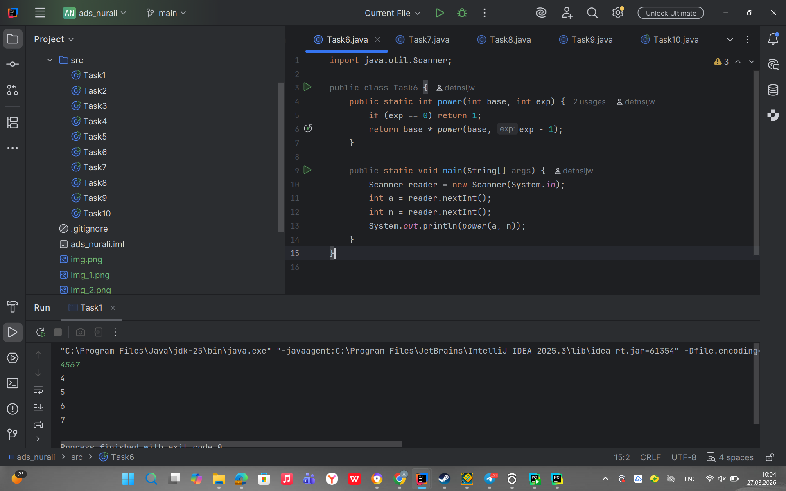
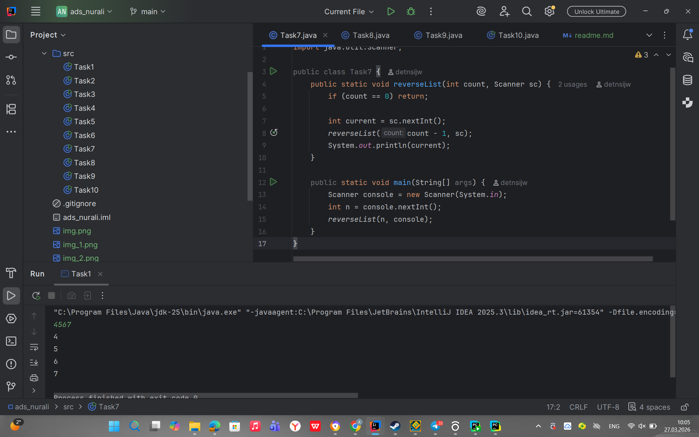
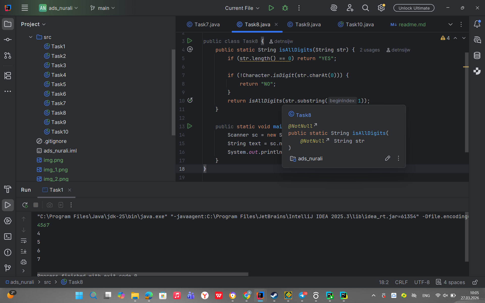
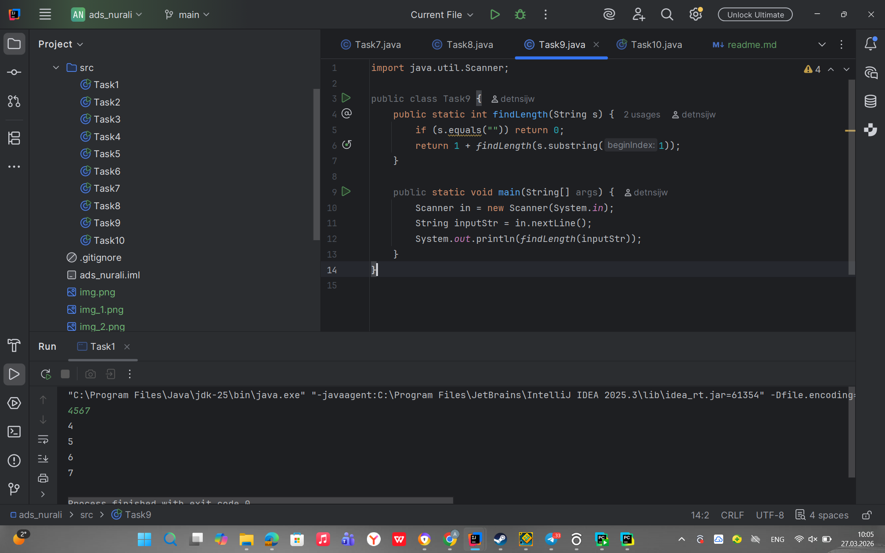
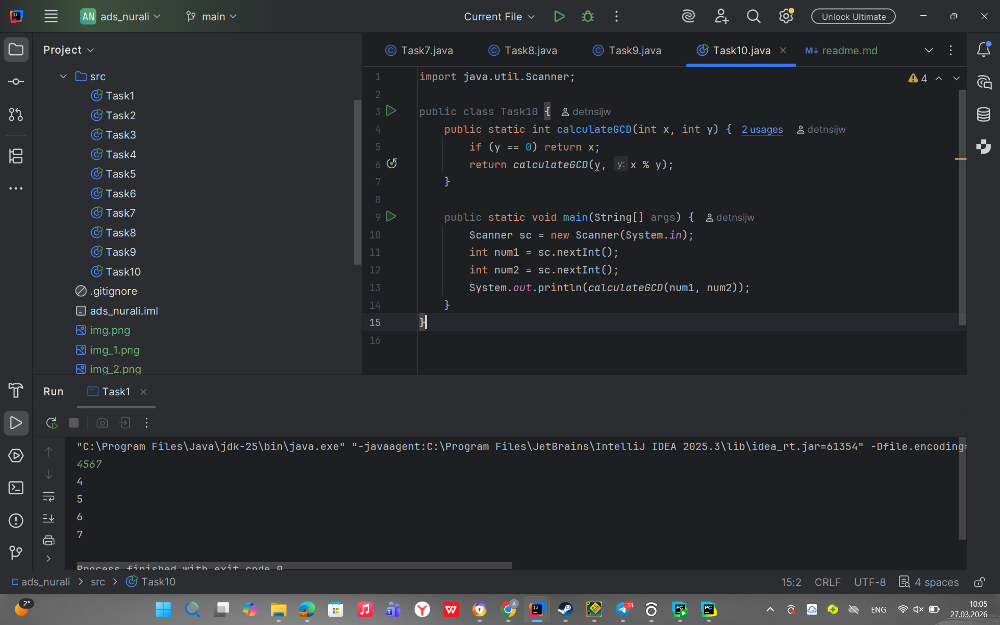

ASSIGNMENT 1 Algorithms and Data Structures

Serikbay Nurali SE-2511

Task 1. Print Digits of a Number

Task 2. Average of Elements

Task 3. Prime Number Check

Task 4. Factorial

Task 5. Fibonacci Number

Task 6. Power Function

Task 7. Reverse Output

Task 8. Check Digits in String

Task 9. Count Characters in a String

Task 10. Greatest Common Divisor (GCD)

